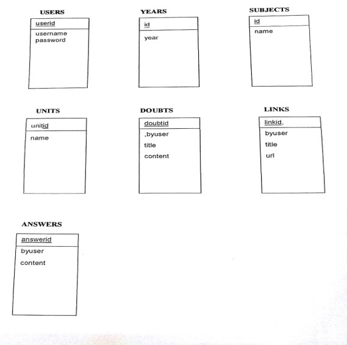
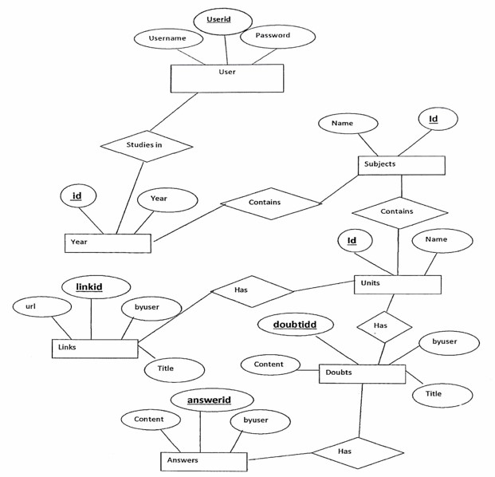

# Mr.-Professor
Android based Question-Answer forum

<h2>PROBLEM STATEMENT</h2>
To develop a Question-Answer Forum

<h2>SCOPE OF PROJECT </h2>

<b>The Problem We All Face</b> 

Many a times the students are unable to understand a concept, either because of lack of proper resource or low grasping power.
Sometimes students need more clarification over a topic. In this case they resort to the Internet. Which ultimately turns out to be a time consuming and exhaustive process. 
Right at the eleventh hour, before an examination students tend to commence their studies when they are faced with unprecedented conundrum. They spend hours together only to ruin their preparation.

<b>How I Tackle It</b> 

I have come up with a platform that is eccentric to the idea of clarifying the simplest of simple doubts.
Students are open to ask any question related to their domain and get them answered. 

<b>How Is Mr. Professor Different?</b>

Many a times similar forums/online portals have a plethora of irrelevant stuff. 
Our  unique ‘up vote’ & ‘down vote’ features ensure that the most probable answer is displayed at the top, followed by all remaining redundant answers.
Furthermore, the stored procedure takes care of all the posts with higher downvotes.

<b>The Application</b>

The application is for every student in a particular University to get his/her doubts clarified right before the exams. 
Sometimes, it may happen so that a potential teacher is waiting for a stage to showcase his/her teaching profess.
All that he/she needs is a well-defined platform.

<h2>Class Diagram</h2>

<h2>TECHNOLOGIES USED</h2>
  Front End:-
  <ol>
    <li>Android SDK</li>
    <li>Android Studio (ver. 2.3.0)</li>
  </ol>
Back End:-
  <ol>
    <li>MySQL</li>
    <li>PHP</li>
    <li>WampServer</li>
  </ol>

